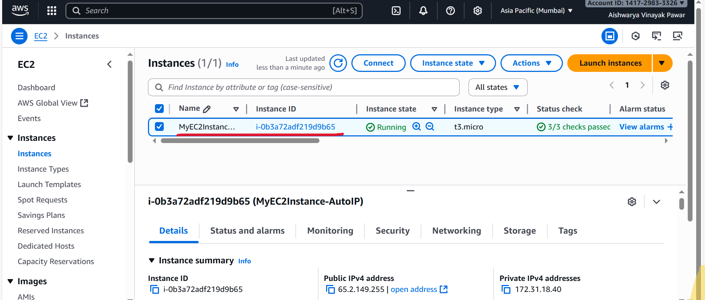
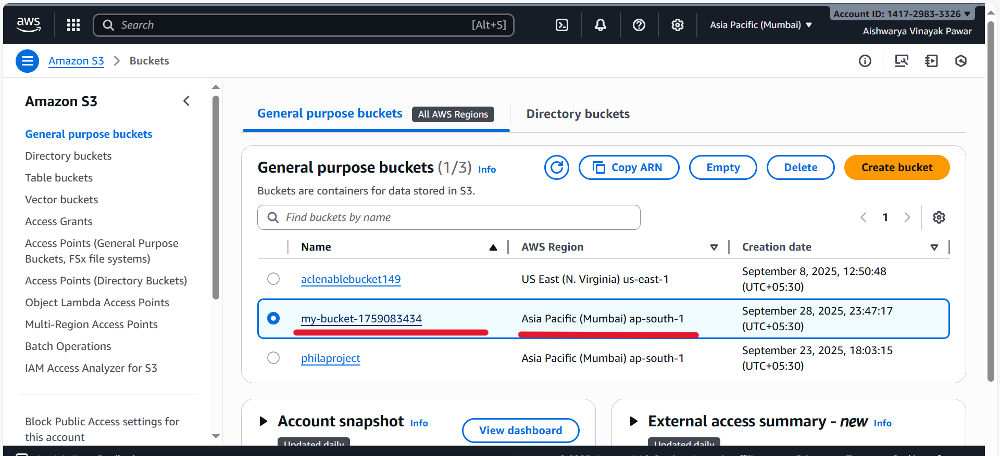
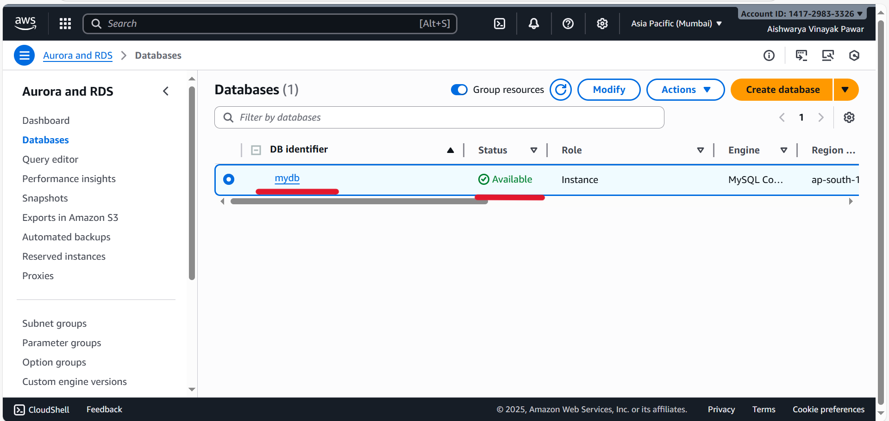
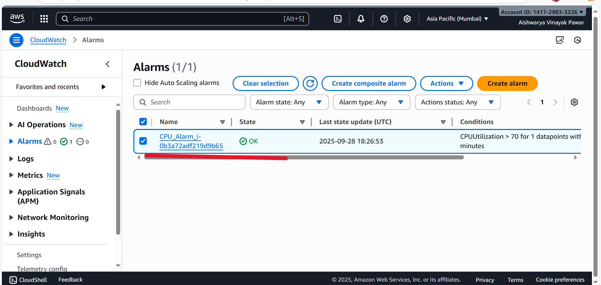
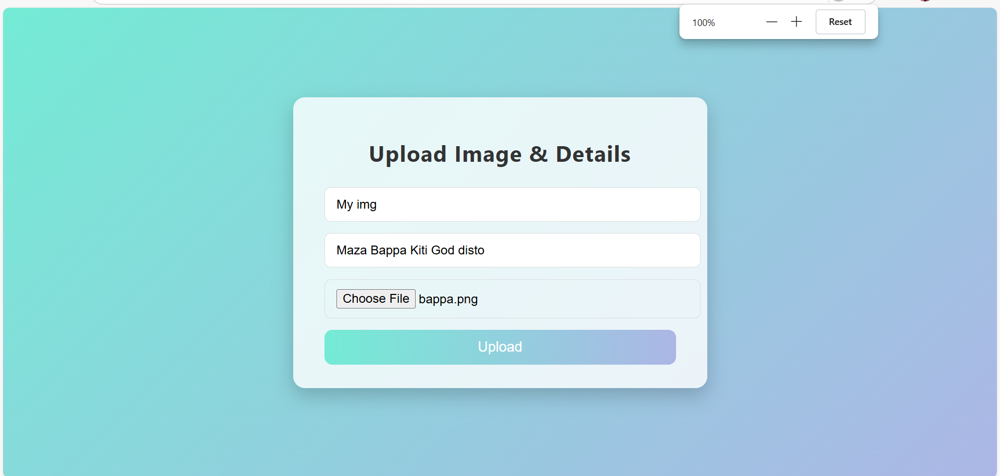
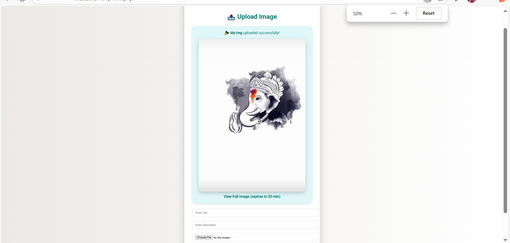
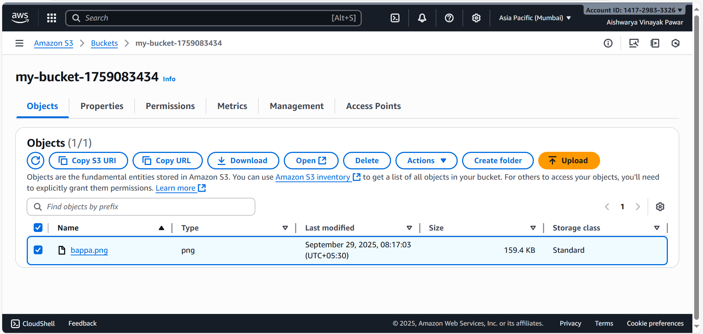

# AWS Image Upload Application (AWS CLI Automation)

A full-stack web application built with PHP that enables users to upload images with metadata, storing files in **AWS S3** and metadata in **AWS RDS MySQL database**. The project was provisioned and managed using **AWS CLI automation scripts** for EC2, S3, RDS, and CloudWatch.

---

##  Architecture Overview


---

##  Features

* **Secure Image Upload:** Supports multiple image formats with validation
* **Cloud Storage:** Images stored in AWS S3 with presigned URLs (20 min expiry)
* **Database Integration:** Metadata stored in AWS RDS MySQL database
* **Responsive UI:** Modern, gradient-based design with animations
* **Infrastructure Automation:** Automated AWS resource provisioning using CLI scripts
* **Monitoring:** CloudWatch CPU utilization monitoring
* **Security:** Proper security groups and IAM configurations

---

##  Prerequisites

* AWS CLI configured with appropriate credentials
* PHP 7.4+ with required extensions
* Composer for PHP dependency management
* MySQL client (optional, for database management)

---

##  Infrastructure Setup

### 1. EC2 Instance Provisioning

```bash
chmod +x ec2_provision_ap_south_1.sh
./ec2_provision_ap_south_1.sh
```

This script will:

* Create or verify SSH key pair (`new.pem`)
* Set up security group `my-sg-mumbai` with ports 22, 80
* Launch t3.micro EC2 instance with auto-assigned public IP
* Tag the instance as `MyEC2Instance-AutoIP`

### 2. RDS MySQL Database Setup

```bash
chmod +x rds_automation.sh
./rds_automation.sh
```

Database Configuration:

* Instance ID: `mydb`
* Engine: MySQL 8.0.42
* Instance Class: db.t3.micro
* Storage: 20 GB
* Master Username: `admin`
* Region: `ap-south-1`

### 3. S3 Bucket Creation

```bash
chmod +x s3_automation.sh
./s3_automation.sh
```

### 4. CloudWatch Monitoring

```bash
chmod +x cloudwatch_automation.sh
./cloudwatch_automation.sh
```

Creates an alarm for CPU utilization > 70% for 5 minutes.

---

##  Database Setup

Connect to your RDS instance and run the SQL commands:

```sql
-- Create database
CREATE DATABASE image_upload_db;

-- Use the database
USE image_upload_db;

-- Create table to store image details
CREATE TABLE images (
    id INT AUTO_INCREMENT PRIMARY KEY,
    title VARCHAR(255) NOT NULL,
    description TEXT NOT NULL,
    image_url VARCHAR(500) NOT NULL,
    created_at TIMESTAMP DEFAULT CURRENT_TIMESTAMP
);
```

---

##  Application Configuration

### PHP Dependencies

```bash
composer require aws/aws-sdk-php
```

### Configuration Files

Update values in `upload.php`:

```php
// MySQL (RDS) connection
$host = 'your-rds-endpoint.region.rds.amazonaws.com';
$user = 'admin';
$pass = 'your-secure-password';
$db   = 'image_upload_db';

// AWS S3 Configuration
$s3 = new S3Client([
    'version' => 'latest',
    'region'  => 'ap-south-1',
    'credentials' => [
        'key'    => 'YOUR_ACCESS_KEY',
        'secret' => 'YOUR_SECRET_KEY',
    ],
]);

$bucket = 'your-s3-bucket-name';
```

---

##  Project Structure

```
aws-image-upload/
├── ec2_provision_ap_south_1.sh    # EC2 instance setup
├── rds_automation.sh              # RDS database creation
├── s3_automation.sh               # S3 bucket setup
├── cloudwatch_automation.sh       # CloudWatch alarm setup
├── index.html                     # Frontend upload form
├── upload.php                     # Backend processing logic
├── rds.sql                        # Database schema
├── uploads/                       # Local backup directory
└── README.md                      # This file
```

---

##  Usage

1. Access the Application: Navigate to your EC2 instance's public IP
2. Upload Images: Use the web form to upload images with title and description
3. View Results: Uploaded images stored in S3 with presigned URLs (20-minute expiry)
4. Database Records: Metadata stored automatically in RDS MySQL

---

##  Security Features

* Security Groups: Minimal required ports
* Presigned URLs: Temporary, secure access to S3 objects
* Input Validation: Server-side validation
* Private S3 Bucket: Objects not publicly accessible
* VPC Integration: Secure private/public subnet setup

---

##  Monitoring & Alerts

* CloudWatch Alarms for CPU utilization
* Optional custom metrics via AWS SDK

---

##  Troubleshooting

* Connection Timeouts → Check security group & VPC rules
* S3 Upload Errors → Verify IAM permissions & bucket policy
* Database Connection → Ensure EC2 security group allows RDS access
* File Upload Limits → Check PHP `upload_max_filesize`

---

##  Project Assets (Execution Flow)

* **1. EC2 Instance Creation**
  


* **2. S3 Bucket Creation**
  


* **3. RDS MySQL Database Setup**
  


* **4. CloudWatch Monitoring Setup**
  

* **6. Website Preview(index.html)**
  

  
* **5. Website Preview (upload.php)**
    

* **7. Uploaded Image in S3 Bucket**
  

---

##  Conclusion

This project demonstrates how to build and deploy a **full-stack image upload application** on AWS using:

- **EC2** for hosting the PHP application  
- **S3** for secure image storage  
- **RDS (MySQL)** for metadata management  
- **CloudWatch** for monitoring and alerts  
- **AWS CLI scripts** for automated provisioning  

By integrating these services, the application achieves **scalability, security, and automation**, making it production-ready and a strong showcase of **cloud computing + DevOps skills**.

---

##  Project Highlights (Resume Friendly)

**Image Upload Application using AWS CLI | EC2, S3, RDS, CloudWatch, Shell Scripting**  
- Built a **full-stack PHP application** to upload images, storing files in **S3** and metadata in **RDS MySQL**.  
- Automated provisioning of **EC2, S3, RDS, and CloudWatch** resources using **AWS CLI shell scripts**, reducing manual setup effort by 60%.  
- Configured **CloudWatch alarms** for proactive monitoring and resource management.  
- Implemented **security best practices** with IAM roles, private S3 buckets, presigned URLs, and VPC-based security groups.  
